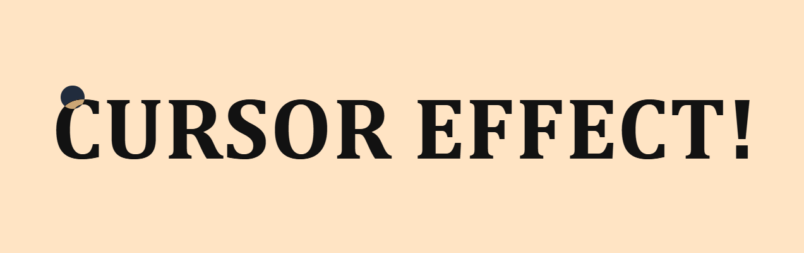

# ✨ Custom Cursor

A minimal animated custom cursor built using **HTML**, **CSS**, and **JavaScript** that follows mouse movement for a sleek browsing experience.

---

## 📸 Preview

 <!-- Replace with actual image name/path -->

---

## 💡 Features

* 🖱️ Smooth animated movement
* 🎯 Tracks real-time mouse position
* 💻 Clean, minimal UI
* 🌐 Works across modern browsers

---

## 🛠 Tech Stack

* HTML5
* CSS3
* JavaScript (Vanilla)

---

## 🚀 Getting Started

1. Clone the repository:

```bash
git clone https://github.com/Khushu2005/custom-cursor.git
cd custom-cursor
```

2. Open `index.html` in your browser to see it in action.

---

## 🌍 Deploy on GitHub Pages

To deploy this project using GitHub Pages:

1. Push the project to a GitHub repository.
2. Go to **Settings** > **Pages**.
3. Under **Source**, select `main` branch and `/root` folder.
4. Save — your site will be live at:

```
https://your-username.github.io/custom-cursor/
```

Replace `your-username` with your GitHub username.

---

## 🔗 Let's Connect

* 💼 LinkedIn: [Khushi Sharma](https://www.linkedin.com/in/khushi-techie)
* 🌟 GitHub: [Khushu2005](https://github.com/Khushu2005)

---

⭐ If you like this project, don’t forget to give it a star!
